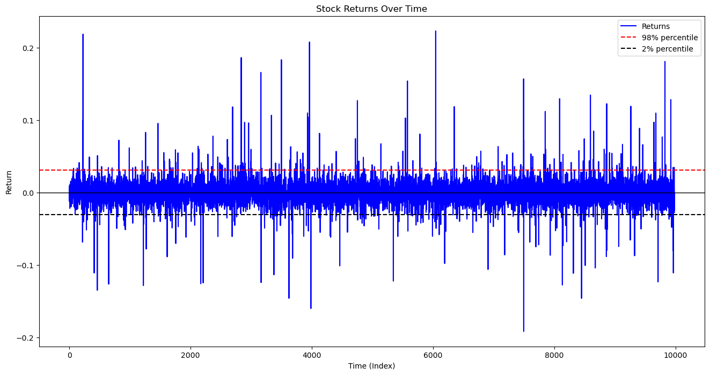
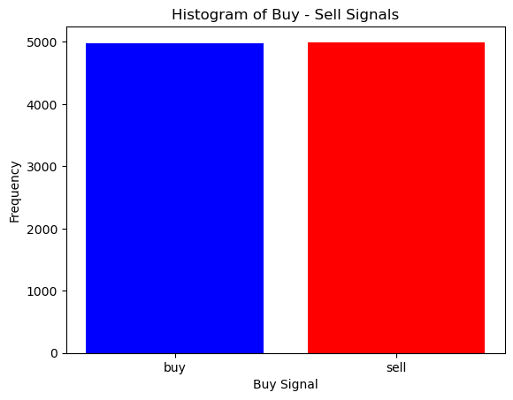
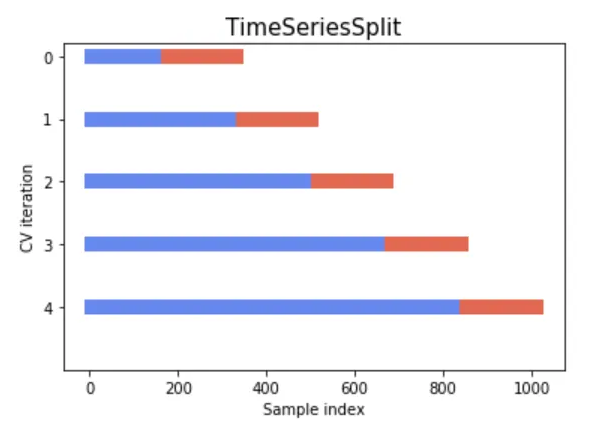

## Description of the Project

This project performs a classification task to predict stock trends using either a classical machine learning model or a neural network. The data is acquired from the [Synethetic-data](https://github.com/ftwasdYK/synthetic-data) repository. 

We begin by analyzing the data and transforming it into a format suitable for training. Next, we discuss the training strategy and present the results obtained. Finally, we provide an example demonstrating the complete end-to-end pipeline — from ingesting new data and processing it, to predicting stock trends.

## Data Analysis
The data analysis is performed in the [notebook](./process_analysis_data.ipynb) and a summary is provided below:

The synthetic consists of the following features:
- stock_price
- volume
- SMA_10
- EMA_10
- MACD
- Signal_Line	
- RSI
- Middle_Band
- Upper_Band
- Lower_Band

Initial statistical analysis revealed that several features are highly correlated with each other. In particular, the following features show strong (98–99%) correlation with the stock_price:
- SMA_10: The simple moving average over 10 days.
- EMA_10: The exponential moving average over 10 days.
- Middle_Band: The middle band of the Bollinger Bands.
- Upper_Band: The upper band of the Bollinger Bands.
- Lower_Band: The lower band of the Bollinger Bands.

To address this redundancy and focus on meaningful variation, stock price returns are calculated instead. A plot of the return prices is shown below:



Next, buy and sell signals are generated based on stock price returns:
* A buy signal is defined when the stock price return is greater than 0.
* A sell signal is defined when the return is less than or equal to 0.

We create a new column called buy_signals, where:
* '1' represents a buy signal
* '0' represents a sell signal

To prevent look-ahead bias, these signals are shifted by one day. This transforms the task into a binary classification problem. A visualization of the buy_signals is shown below:



Following this step, some NaN values appear in the dataset, which we handle by dropping the corresponding rows.

Finally, we prepare three datasets for model training:
1. Dataset without the highly correlated features
2. Full dataset including all features, where PCA is applied to reduce dimensionality. The number of principal components is set to match the number of features in the uncorrelated dataset.
3. Target variable dataset, which contains the buy_signals.

The datasets are saved in the `processed_data/` directory. The full dataset is saved as `processed_data/x_full_data.csv`, the dataset without the correlated features is saved as `processed_data/x_uncorrelated_data.csv`, and the target variable is saved as `processed_data/y_data.csv`.

The first dataset consists of the following selected features:
* returns
* EMA_10 
* MACD
* Signal Line 
* RSI 
* Volume


So the second dataset will have 6 compoments after perfoming PCA.


## Training Strategy

Since we are working with time series data, it's important to preserve the temporal order of the observations. To do this, we use a sliding window approach to create the training and validation sets.

We also reserve a test set of 1,000 samples, which corresponds to approximately 4 years of daily trading data. This test set is used exclusively for final evaluation after model development is complete.

For model selection, we employ a grid search approach to identify the best hyperparameters. To ensure robust evaluation during grid search, we use 5-fold time series cross-validation, which respects the sequential nature of the data.

The data splitting strategy is illustrated in the figure below:



Given the relatively small size of the dataset, we apply the same time-series cross-validation strategy to both traditional machine learning models and neural networks. For neural networks, we use a custom grid search implementation tailored to their training process.

The trained classical machine learning models are saved in the `models_ckp/` directory, while the neural network models weights are stored in the `checkpoints/` directory.
Since the dataset is balanced, we use **accuracy** as the primary evaluation metric for model selection.

## Results
The `results_training/` directory contains the evaluation results of the models on the test set, after all experiments on the train-validation sets are completed. Meanwhile, the `results/` directory stores the output of the `main.py` script, where the models are evaluated on new, incoming data using the complete end-to-end pipeline.

## How to Install
1. Clone the repository to your local machine:
    ```bash
    git clone https://github.com/ftwasdYK/SynthStockPredictor.git
    ```
2. Create and activate a virtual enviroment:
    ```bash
    python3.11 -m venv .myenv
    source .myenv/bin/activate
    ```
3. Install the required dependencies:
    ```bash
    pip install -r requirements.txt
    ```

## How to Use It

run the following command to start the application:
    
```bash
python main.py
```

The arguments for `main.py` are:
- --data_dir: Path to the input data directory (default: "raw_data/raw_data.csv").
- --model_type: Type of model to use ('ml' for machine learning, 'nn' for neural network; default: "ml").
- --dir_results: Directory to save the prediction results (default: "results/results.csv").

The `main.py` script is responsible for loading data from a specified directory, performing predictions using the selected model type, and saving the results to the designated output directory.

**NOTE**:

The assumption is that new data is unprocessed. The pipeline will handle all necessary preprocessing steps. Therefore, the new data should be provided in DataFrame format, containing only the **stock price** and **volume**.